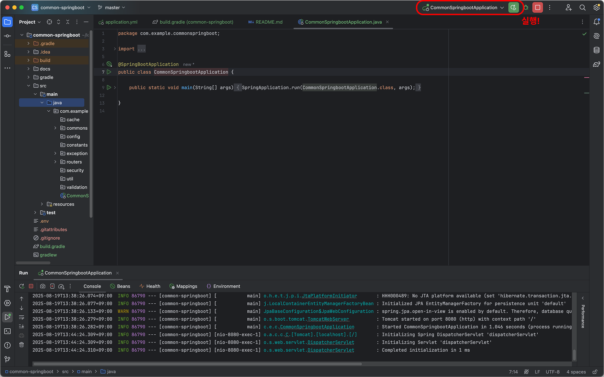

# Spring Boot Project Template
- 스프링부트를 쉽고 빠르게 생성하기 위한 템플릿
1. 알고 있는 스프링 부트 기술을 모두 접목
2. 존재하는 모든 코드에 주석으로 설명 작성

# Settings
## Step 1. Download JDK25
- 본 프로젝트에는 JDK25, SpringBoot 4.0.0-M1을 기반으로 합니다.

## Step 2. Launch MariaDB
1. 본 프로젝트는 MariaDB를 활용합니다. `.env`에 본인의 계정 정보를 추가해주세요.
```markdown
DB_USER: {your_database_user}
DB_PASSWORD: {your_database_password}
```
2. develop_database 데이터베이스 생성
- mariadb에 develop_database를 생성하세요.
> 자동으로 생성되기를 원하면 테이블 생성 권한이 있는 DB_USER를 이용하세요. 

## Step 3. 실행여부 확인
- 직접 접속해보세요! [Swagger UI 바로가기](http://localhost:8080/swagger-ui/index.html)

# How to Install
## from IDEA
- Intellij IDEA Ultimate
1. CommonSpringbootApplication.java로 이동한다.


## 2. from JAR
- TODO

## 3. from Docker
- TODO

# API Documentation
- [Swagger UI](http://localhost:8080/swagger-ui/index.html)

# Directory Structure
- [Directory Strategy](docs/strategy/directory)

# Git Strategy
### Branch Strategy
- [Branch Strategy](docs/strategy/branch)

### PR Strategy
- [Pull Request Strategy](docs/strategy/pull-request)

### Issue Strategy
- [Issue Strategy](docs/strategy/issue)

# Dependency & Library
| Name                                | Description                                                                                                                                                                                                                      | Version  |
|-------------------------------------|----------------------------------------------------------------------------------------------------------------------------------------------------------------------------------------------------------------------------------|----------|
| spring-boot-starter                 | Core starter that brings Spring Boot, auto-configuration, and logging (Logback via spring-boot-starter-logging); includes YAML configuration support.                                                                            | 4.0.0-M1 |
| spring-boot-starter-web             | Servlet-based web starter: Spring MVC auto-configuration, embedded Tomcat by default (Jetty/Undertow switchable), JSON support via Jackson, static-resource handling, and basic error handling.                                  | 4.0.0-M1 |
| spring-boot-starter-data-jdbc       | Spring Data JDBC starter: auto-configures DataSource (HikariCP by default), `JdbcTemplate`/`NamedParameterJdbcTemplate`, transactions, and Spring Data JDBC repositories. No JPA/ORM, no lazy loading—simple, SQL-first mapping. | 4.0.0-M1 |
| spring-boot-starter-data-jpa        | JPA starter: Spring Data JPA + Hibernate ORM, auto-configures `EntityManagerFactory`, transactions, JPA repositories, and common JPA properties (DDL auto, dialect, etc.). Suited for ORM-based domain models.                   | 4.0.0-M1 |
| spring-boot-starter-test            | Testing starter (test scope): JUnit Jupiter, Spring Test/Boot Test, AssertJ, Mockito, JSONassert, JsonPath, Hamcrest, and auto-config for slice tests (@WebMvcTest, @DataJpaTest, etc.).                                         | 4.0.0-M1 |
| junit-platform-launcher             | JUnit Platform Launcher API used to discover and execute tests on the JUnit Platform (e.g., by IDEs and Maven Surefire/Failsafe). Enables running JUnit Jupiter and other engines.                                               | 6.0.0-M2 |
| spring-security-crypto              | Spring Security crypto utilities: password hashing (BCrypt, PBKDF2, scrypt, Argon2), DelegatingPasswordEncoder, symmetric encryption helpers (e.g., AES-GCM/CBC), and key generators.                                            | 7.0.0-M1 |
| springdoc-openapi-starter-webmvc-ui | OpenAPI 3 for Spring MVC with Swagger UI: auto-generates `/v3/api-docs` and serves interactive docs at `/swagger-ui.html`; supports grouping, customizers, and schema generation from controllers and models.                    | 2.8.9    |
| lombok                              | Annotation-based boilerplate reduction (getters/setters, builders, equals/hashCode, logging, etc.).                                                                                                                              | 1.18.38  |
| mariadb-java-client                 | MariaDB Connector/J JDBC driver for MariaDB (and MySQL-compatible) databases; provides wire protocol, TLS, failover/replication support, and is used by the Spring Boot DataSource/HikariCP auto-configuration.                  | 3.5.5    |
| me.paulschwarz:spring-dotenv        | TODO...                                                                                                                                                                                                                          | 4.0.0    |

# Support
### E-Mail
- aduwnssp@gmail.com

### Contributer
| Name | Role   | Description | Link                                                             |
|------|--------|-------------|------------------------------------------------------------------|
| 김명준  | Writer | 김명준입니다.     | [gomj Repository](https://github.com/gomj-repo?tab=repositories) |

# License
|Name|License|CopyRight|
|---|---|---|
|name|license|copy_right|